Data model option: - document store
Database software to use: MongoDB
QUESTION 1: SETUP
Setup instructions
Install on windows 11 operating system
MongoDB version 8.0.12
Download from this link: Install MongoDB Community Kubernetes Operator | MongoDB

Installing steps
-	Double click the installer to initiate the installation process

 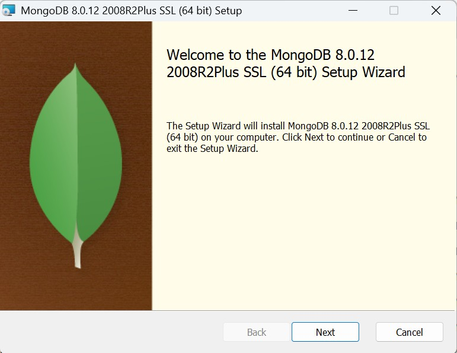

-	Click next and accept the terms of agreement

 

-	Click Next and then select Complete to install the complete package

 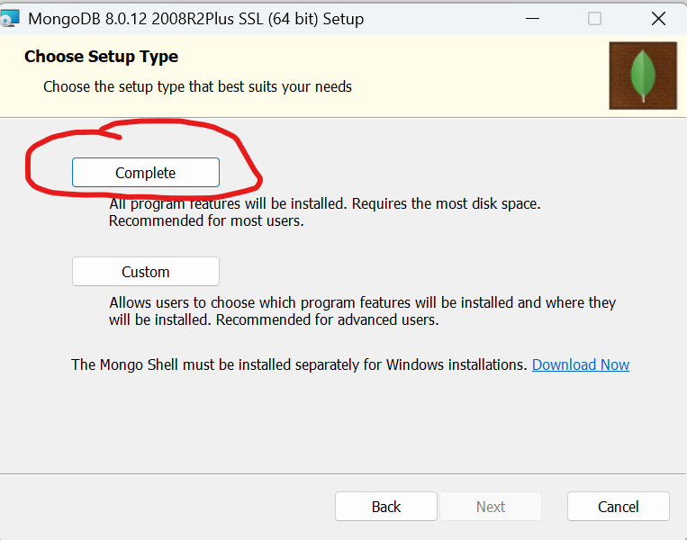

Screenshots
 Missed – install as a service, install compass, finish

Launch MongoDB compass, select add new connection

 

Specify the following parameters in the window that appears
Uri: mongodb://localhost:27017
Name: mongoDBAssignment
Save&Connect

QUESTION 2: BASIC OPERATIONS

Create database
We will use mongoDB shell (mongosh) to demonstrate CRUD
In the Context of a Recruitment System, we will use recruitmentDB as our database, applicants as the collection and each applicant record as a document, each applicant document will include:
applicantId (Number)
name (String)
gender (String)
position (String)
score (Number)
status (String: "pending", "shortlisted", "rejected")

STEPS

1.	create recruitmentDB database
          
command

use recruitmentDB

expected output
 
 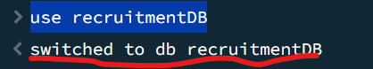

2. CREATE: add sample documents to our recruitment database

a.	command to add a document to applicants’ collection
db.applicants.insertOne({
  applicantId: 111,
  name: "Janet Chebet",
  gender: "Female",
  position: "Procurement Officer",
  score: 87,
  status: "pending"
})

Sample Output

 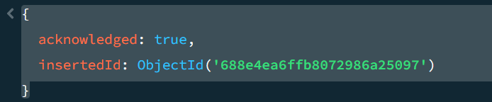

b.	insert many records(add many documents to applicants collection)

db.applicants.insertMany([
  { applicantId: 101, name: "Grace Wanjiku", gender: "Female", position: "ICT Officer", score: 82, status: "pending" }, 
  { applicantId: 102, name: "James Otieno", gender: "Male", position: "Clerk", score: 75, status: "pending" }, 
  { applicantId: 103, name: "Mary Atieno", gender: "Female", position: "Clerk", score: 90, status: "pending" }, 
  { applicantId: 104, name: "Peter Mwangi", gender: "Male", position: "Accountant", score: 68, status: "rejected" }, 
  { applicantId: 105, name: "Amina Yusuf", gender: "Female", position: "ICT Officer", score: 88, status: "shortlisted" }, 
  { applicantId: 106, name: "John Kimani", gender: "Male", position: "Security Officer", score: 72, status: "pending" }, 
  { applicantId: 107, name: "Susan Nyambura", gender: "Female", position: "Secretary", score: 85, status: "shortlisted" }, 
  { applicantId: 108, name: "Kevin Onyango", gender: "Male", position: "Driver", score: 65, status: "pending" }, 
  { applicantId: 109, name: "Lucy Njeri", gender: "Female", position: "Accountant", score: 91, status: "shortlisted" }, 
  { applicantId: 110, name: "Brian Kiptoo", gender: "Male", position: "ICT Officer", score: 79, status: "pending" } 
]) 

Output
 
 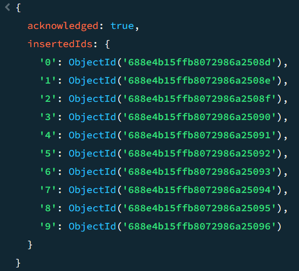

2. READ: Query applicants

a. To retrieve all applicants use the following command
                 db.applicants.find()
This returns all the 11 records inserted
Sample output

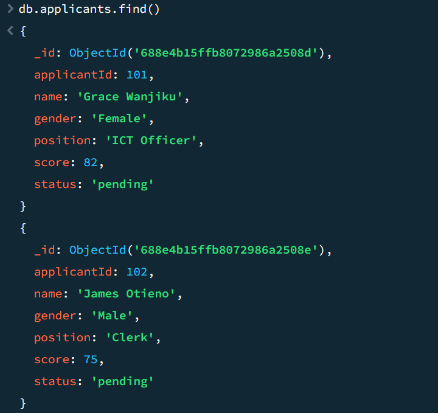
 

b. use the following command to get all applicants who applied for the Clerk position
     db.applicants.find({ position: "Clerk" })

sample output

 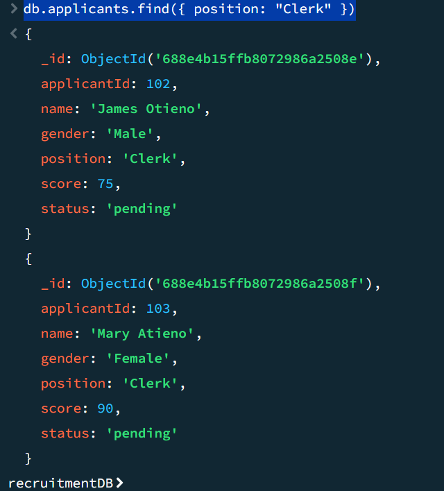

c. To get all applicants with scores above 90, use the following command
     db.applicants.find({ score: { $gte: 90 } })
    Sample output
   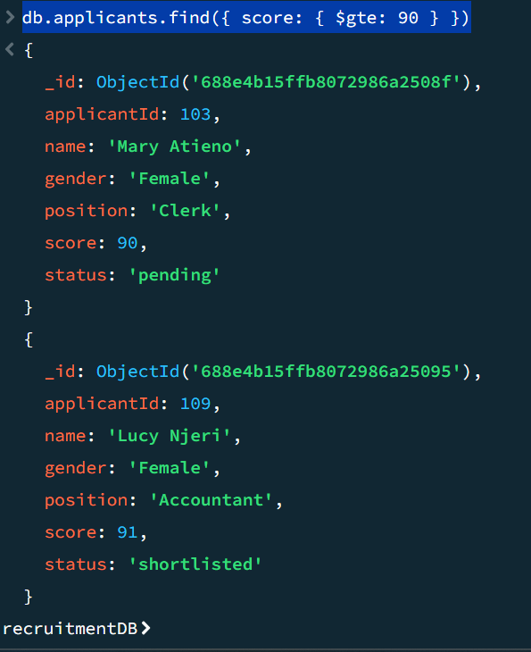

3. UPDATE: Modify Applicants Records
a. to shortlist applicant with a score of more than 80 use the following command
db.applicants.updateMany(
  { score: { $gte: 80 } },
  { $set: { status: "shortlisted" } }
)

Output is as follows

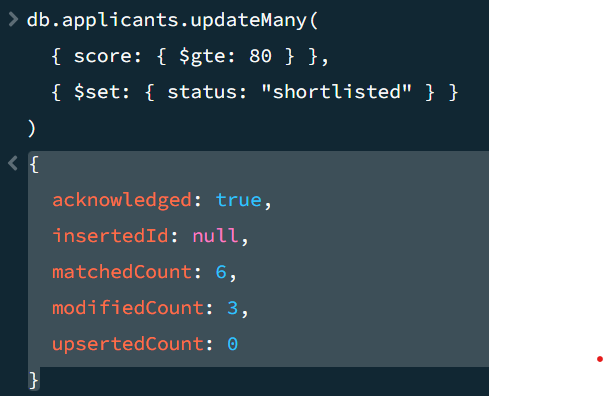
 
b. to update applicant name by ID use the following command
db.applicants.updateOne(
  { applicantId: 102 },
  { $set: { name: "James O. Otieno" } }
)
Output is as follows

 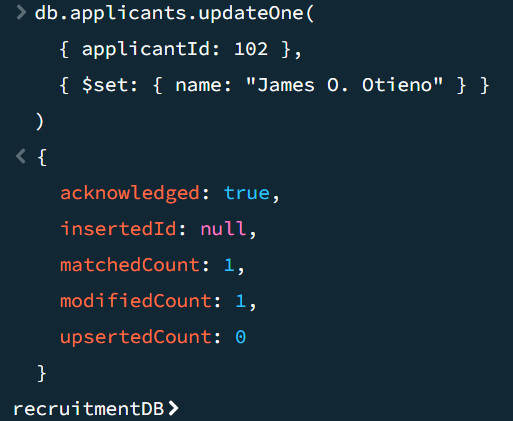

4. DELETE:- remove applicant records

a.	Delete an applicant   by id

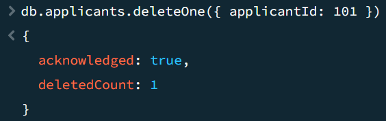

Command:

db.applicants.deleteOne({ applicantId: 101 })

output is as follows

 

b.	To delete all rejected applicants

Command:

db.applicants.deleteMany({ status: "rejected" })

output is as follows

 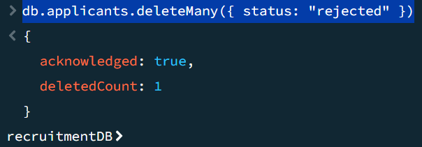

Sample data used in JSON format

[ 
  {
    "applicantId": 101,
    "name": "Grace Wanjiku",
    "gender": "Female",
    "position": "ICT Officer",
    "score": 82,
    "status": "pending"
  }, 
  {
    "applicantId": 102,
    "name": "James Otieno",
    "gender": "Male",
    "position": "Clerk",
    "score": 75,
    "status": "pending"
  }, 
  {
    "applicantId": 103,
    "name": "Mary Atieno",
    "gender": "Female",
    "position": "Clerk",
    "score": 90,
    "status": "pending"
  }, 
  {
    "applicantId": 104,
    "name": "Peter Mwangi",
    "gender": "Male",
    "position": "Accountant",
    "score": 68,
    "status": "rejected"
  }, 
  {
    "applicantId": 105,
    "name": "Amina Yusuf",
    "gender": "Female",
    "position": "ICT Officer",
    "score": 88,
    "status": "shortlisted"
  }, 
  {
    "applicantId": 106,
    "name": "John Kimani",
    "gender": "Male",
    "position": "Security Officer",
    "score": 72,
    "status": "pending"
  }, 
  {
    "applicantId": 107,
    "name": "Susan Nyambura",
    "gender": "Female",
    "position": "Secretary",
    "score": 85,
    "status": "shortlisted"
  }, 
  {
    "applicantId": 108,
    "name": "Kevin Onyango",
    "gender": "Male",
    "position": "Driver",
    "score": 65,
    "status": "pending"
  }, 
  {
    "applicantId": 109,
    "name": "Lucy Njeri",
    "gender": "Female",
    "position": "Accountant",
    "score": 91,
    "status": "shortlisted"
  }, 
  {
    "applicantId": 110,
    "name": "Brian Kiptoo",
    "gender": "Male",
    "position": "ICT Officer",
    "score": 79,
    "status": "pending"
  } 
]  
QUESTION 3: APPLIED SCENARIO 
Public Service Commission normally collects thousands of applicants records for the purposes of recruiting persons to serve in the public organizations. A portal is used to collect this data. Applicants’ profiles are normally varied in a way depending on the job descriptions. The profiles are build based on: personal information, qualifications, work experiences, jobs applied, status of the applications among others. 
MongoDB can be applied in this scenario because of the variance of applicants’ data; it can allow for nesting information when building applicants profile thus allowing the applicants profiles to be stored as self-contained documents. It makes it easy to add new fields like interview dates or remarks without changing the schema. The Document format maps well with the PSC web portal thus also contributing to improvement in responsiveness during high traffic times. 
MongoDB database can be used to model this problem by storing each applicant as a document in the applicants collection as shown below: - 
{ 
  "applicantId": 103,
  "name": "Mary Atieno",
  "gender": "Female",
  "position": "Clerk",
  "score": 90,
  "status": "pending",
  "disabilityStatus": "none",
  "contact": {
    "email": "mary.atieno@example.com",
    "phone": "0712345678"
  }, 
  "workExperience": [ 
    { "company": "KRA", "years": 2 },
    { "company": "County Office", "years": 1 } 
  ] 
} 
This document format allows for the storage of nested and optional data therefore, eliminating the need for complex joins or rigid table structure 
 
Queries can be used to solve the issue of data retrieval as shown below: -
a.	to shortlist all applicants with minimum score of 80%, use 
db.applicants.updateMany( 
  { score: { $gte: 80 } },
  { $set: { status: "shortlisted" } }
) 
b.	to filter by gender and disability use 
db.applicants.find({ 
  gender: "Female",
  disabilityStatus: { $ne: "none" }
}) 

GROUP CONTRIBUTION SUMMARY: 
Name: Samuel Shadiva Tokoye 
Student ID: 222072 
Responsibilities: 
•	MongoDB setup 
•	Scenario design  

Name: Elizabeth [COMPLETE THE NAME] 
Student ID: [INSERT_STUDENT_ID] 
Responsibilities: 
•	CRUD implementation 
•	Screenshots and visuals 

Name: Catherine [COMPLETE THE NAME] 
Student ID: [INSERT_STUDENT_ID] 
Responsibilities: 
•	Markdown lab documentation

