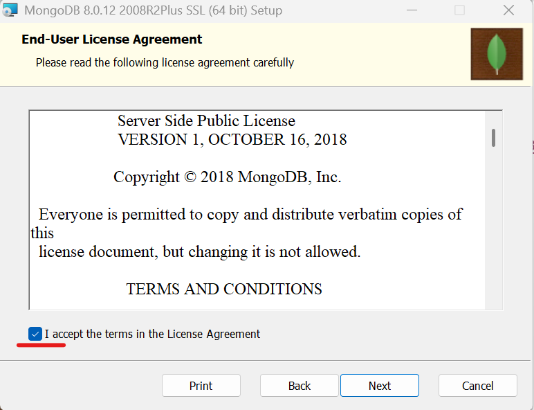
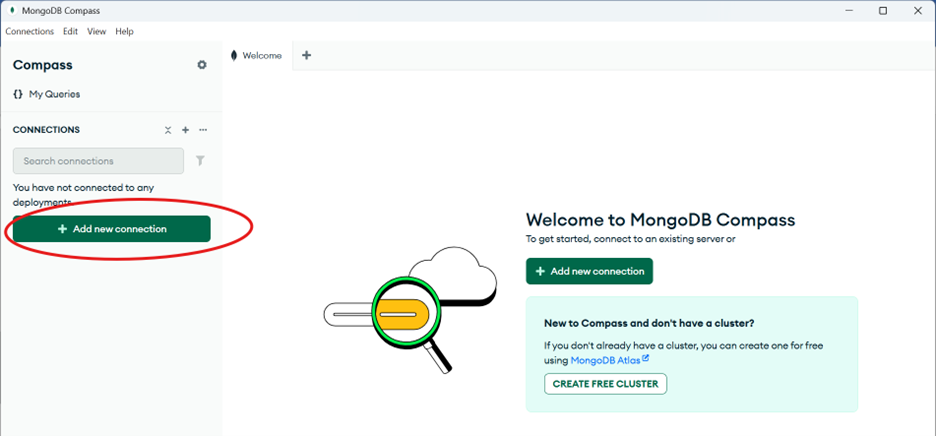

<h1>Data model option: - document store</h1>

Database software to use: MongoDB  
This lab provides a practical introduction to the Document Store data model, one of the most widely used approaches in the NoSQL database family. Using MongoDB, you will install, configure, and interact with a document store environment from scratch. 
In approximately 30–60 minutes, you will: 
-Set up a MongoDB instance a direct local installation. 
-Perform essential CRUD (Create, Read, Update, Delete) operations. 
-Apply your skills to a realistic recruitment system scenario, demonstrating why document stores are ideal for flexible and evolving data structures. 

<h3>QUESTION 1: SETUP</h3>
Setup instructions 
Install on windows 11 Operating System 
MongoDB version 8.0.12
Download from this link: https://www.mongodb.com/try/download/community 

Installation steps 
-	Double click the installer to initiate the installation process

 

-	Click **Next** and accept the End-User License Agreement

 

-	Click **Next** and then select Complete to install the complete package

 

Service Configuration 
 

Install MongoDB Compass 
 

Install Mongo Server 
 

Installation Process 
 

Launch MongoDB compass, select add new connection

 

Specify the following parameters in the window that appears
Uri: **mongodb://localhost:27017** 
Name: **mongoDBAssignment** 
**Save&Connect** 

You have successfully installed MondoDB server, you can now interact with it is by performiing(Create, Read, Update, Delete) operations. 

<h3>QUESTION 2: BASIC OPERATIONS</h3>

Create database
We will use mongoDB shell (mongosh) to demonstrate CRUD 
The database instance in this case is that of a Recruitment system where applicants will be the collection and each applicant record stored as a document. Each applicant record will include the following: 
applicantId (Number) 
name (String) 
gender (String) 
position (String) 
score (Number) 
status (String: "pending", "shortlisted", "rejected") 

**STEPS**

1.	Create recruitmentDB database
          
Use this command: **use recruitmentDB**

Expected output
 
 

2. **CREATE**: We implement this operation to add sample documents to our recruitment database

a.	Command to add a document to applicants’ collection 
db.applicants.insertOne({ 
  applicantId: 111, 
  name: "Janet Chebet", 
  gender: "Female", 
  position: "Procurement Officer", 
  score: 87, 
  status: "pending" 
}) 

Sample Output

 

b.	Insert many records(add many documents to applicants collection)

db.applicants.insertMany([
  { applicantId: 101, name: "Grace Wanjiku", gender: "Female", position: "ICT Officer", score: 82, status: "pending" }, 
  { applicantId: 102, name: "James Otieno", gender: "Male", position: "Clerk", score: 75, status: "pending" }, 
  { applicantId: 103, name: "Mary Atieno", gender: "Female", position: "Clerk", score: 90, status: "pending" }, 
  { applicantId: 104, name: "Peter Mwangi", gender: "Male", position: "Accountant", score: 68, status: "rejected" }, 
  { applicantId: 105, name: "Amina Yusuf", gender: "Female", position: "ICT Officer", score: 88, status: "shortlisted" }, 
  { applicantId: 106, name: "John Kimani", gender: "Male", position: "Security Officer", score: 72, status: "pending" }, 
  { applicantId: 107, name: "Susan Nyambura", gender: "Female", position: "Secretary", score: 85, status: "shortlisted" }, 
  { applicantId: 108, name: "Kevin Onyango", gender: "Male", position: "Driver", score: 65, status: "pending" }, 
  { applicantId: 109, name: "Lucy Njeri", gender: "Female", position: "Accountant", score: 91, status: "shortlisted" }, 
  { applicantId: 110, name: "Brian Kiptoo", gender: "Male", position: "ICT Officer", score: 79, status: "pending" } 
]) 

Output
 
 

2. **READ**: We implement this operation to query applicants

a. To retrieve all applicants use the following command
                 db.applicants.find()
This returns all the 11 records inserted
Sample output

 

b. Use the following command to get all applicants who applied for the Clerk position
     db.applicants.find({ position: "Clerk" })

Sample output

 

c. To get all applicants with scores above 90, use the following command
     db.applicants.find({ score: { $gte: 90 } })
Sample output

3.**UPDATE:** Modify Applicants Records 
a. To shortlist applicant with a score of more than 80 use the following command 
db.applicants.updateMany( 
  { score: { $gte: 80 } }, 
  { $set: { status: "shortlisted" } } 
) 

Output is as follows

 
b. To update applicant name by ID use the following command 
db.applicants.updateOne( 
  { applicantId: 102 }, 
  { $set: { name: "James O. Otieno" } } 
) 
Output is as follows

4. **DELETE:** remove applicant records 

a.	Delete an applicant   by id 

Command:

db.applicants.deleteOne({ applicantId: 101 })

output is as follows

 

b.	To delete all rejected applicants

Command:

db.applicants.deleteMany({ status: "rejected" })

output is as follows

 

Sample data used in JSON format

[ 
  {
    "applicantId": 101,
    "name": "Grace Wanjiku",
    "gender": "Female",
    "position": "ICT Officer",
    "score": 82,
    "status": "pending"
  }, 
  {
    "applicantId": 102,
    "name": "James Otieno",
    "gender": "Male",
    "position": "Clerk",
    "score": 75,
    "status": "pending"
  }, 
  {
    "applicantId": 103,
    "name": "Mary Atieno",
    "gender": "Female",
    "position": "Clerk",
    "score": 90,
    "status": "pending"
  }, 
  {
    "applicantId": 104,
    "name": "Peter Mwangi",
    "gender": "Male",
    "position": "Accountant",
    "score": 68,
    "status": "rejected"
  }, 
  {
    "applicantId": 105,
    "name": "Amina Yusuf",
    "gender": "Female",
    "position": "ICT Officer",
    "score": 88,
    "status": "shortlisted"
  }, 
  {
    "applicantId": 106,
    "name": "John Kimani",
    "gender": "Male",
    "position": "Security Officer",
    "score": 72,
    "status": "pending"
  }, 
  {
    "applicantId": 107,
    "name": "Susan Nyambura",
    "gender": "Female",
    "position": "Secretary",
    "score": 85,
    "status": "shortlisted"
  }, 
  {
    "applicantId": 108,
    "name": "Kevin Onyango",
    "gender": "Male",
    "position": "Driver",
    "score": 65,
    "status": "pending"
  }, 
  {
    "applicantId": 109,
    "name": "Lucy Njeri",
    "gender": "Female",
    "position": "Accountant",
    "score": 91,
    "status": "shortlisted"
  }, 
  {
    "applicantId": 110,
    "name": "Brian Kiptoo",
    "gender": "Male",
    "position": "ICT Officer",
    "score": 79,
    "status": "pending"
  } 
]  

**<h3>QUESTION 3: APPLIED SCENARIO</h3> **
Public Service Commission normally collects thousands of applicants records for the purposes of recruiting persons to serve in the public organizations. A portal is used to collect this data. Applicants’ profiles are normally varied in a way depending on the job descriptions. The profiles are build based on: personal information,academic qualifications, professional qualifications, work experiences, membership to professional bodies,jobs applied, status of the applications among others.   

<h3>Problem</h3> 

Retrieval of applicants records using table joins is very slow especially when it comes to working with large datasets that requires data from multiple tables. 
This happens during shortlisting and interviews. During shortlisting only applicants that meet certain criterias are retrived. And during interviews complete applicant profiles are needed. For example:- 

a) To return a list of all applicants who have met certain criterias for shortlisting purposes table joins are used as shown below.

SELECT * FROM applicants  
LEFT JOIN academic_qualifications ON applicants.id = academic_qualifications.applicant_id   
LEFT JOIN professional_qualifications ON applicants.id = professional_qualifications.applicant_id   
LEFT JOIN membership_bodies ON applicants.id = membership_bodies.applicant_id  
WHERE  professional_qualifications IN('CCNA', 'CISM') AND membership_bodies IN('IEEE', 'ISACA');  

b) To retrieve an applicant profile, joins of all required tables is performed as shown below:- 

SELECT * FROM applicants   
LEFT JOIN academic_qualifications ON applicants.id = academic_qualifications.applicant_id   
LEFT JOIN professional_qualifications ON applicants.id = professional_qualifications.applicant_id   
LEFT JOIN membership_bodies ON applicants.id = membership_bodies.applicant_id where applicants.id = 112; br>

c) How the database can be used to model this problem. 
MongoDB’s document model can allow for clean and nested representation of this data within a single applicant record without normalization. 
For instance, the sample applicant data below demonstrates how the MongoDB database can model this problem. We can have applicants with different profiles, for instance applicant 103 and applicant 112 have totally different profiles, their additional data are nested under their profiles. This data can be retrieved using the queries below without performing any joins thus improving query performance.

applicant 103
 
{ 
  "applicantId": 103,
  "name": "Mary Atieno",
  "gender": "Female",
  "position": "Clerk",
  "score": 90,
  "status": "pending",
  "disabilityStatus": "none",
  "contact": {
    "email": "mary.atieno@example.com",
    "phone": "0712345678"
  }, 
  "workExperience": [ 
    { "company": "KRA", "years": 2 },
    { "company": "County Office", "years": 1 } 
  ] 
  
  
applicant 112 

{ 
  "applicantId": 112,
  "name": "Josephine Naliaka",
  "gender": "Female",
  "position": "ICT Officer",
  "score": 86,
  "status": "pending",
  "academicQualifications": [
    {
      "level": "Diploma",
      "field": "Information Technology",
      "institution": "Technical University of Kenya",
      "year": 2018
    }, 
    {
      "level": "Degree",
      "field": "Computer Science",
      "institution": "Jomo Kenyatta University of Agriculture and Technology",
      "year": 2021
    }
  ], 
  "professionalCertifications": [
    {
      "name": "CCNA",
      "institution": "Cisco",
      "year": 2022
    },
    {
      "name": "CISM",
      "institution": "ISACA",
      "year": 2023
    }
  ], 
  "professionalMemberships": [
    {
      "organization": "ISACA",
      "membershipNumber": "IS567890",
      "since": 2023
    }
  ]
} 

<h3>How the model resolves the problem of table joins</h3>

a) To return a list of all applicants who have met certain criterias for shortlisting purposes, the following query is used without performing complex table joins 

db.applicants.find({ 
  "professionalCertifications.name": { $in: ["CCNA", "CISM"] }, 
  "membership_bodies.organization": { $in: ["IEEE", "ISACA"] } 
}) 

b) To retrieve an entire applicant profile during interview without table joining only one query is used as shown below for the case of applicant 112.  

db.applicants.findOne({ applicant_id: "112" }) 

<h3>GROUP CONTRIBUTION SUMMARY:</h3> 

**Name: Samuel Shadiva Tokoye** 
Student ID: 222072 
Responsibilities: 
•	MongoDB setup 
•	Scenario design  

**Name: Elizabeth Sikuku** 
Student ID: 096039 
Responsibilities: 
•	CRUD implementation 
•	Screenshots and visuals 

**Name: Catherine Anyango** 
Student ID: 223933 
Responsibilities: 
•	Markdown lab documentation

